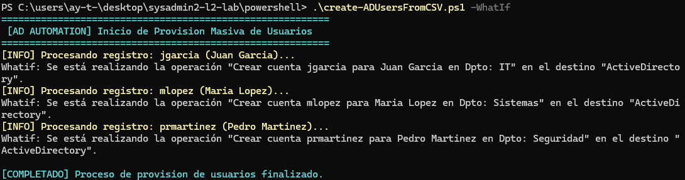
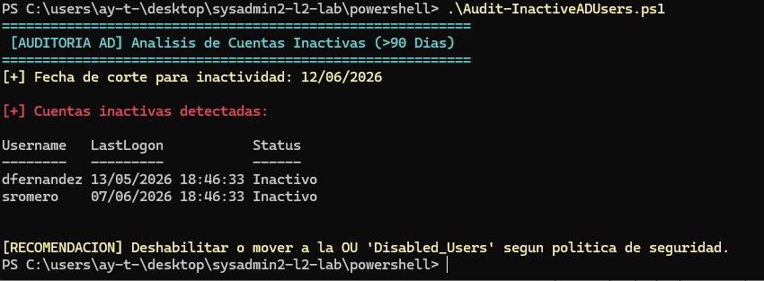

# 🛠️ SysAdmin L2 / Infrastructure & Automation Lab

Este repositorio reúne un conjunto de proyectos prácticos, scripts de automatización y procedimientos operativos orientados a la **administración de sistemas (SysAdmin L2)**, **soporte de infraestructuras** y **gestión de identidades**.

El objetivo de este laboratorio es demostrar capacidades técnicas reales en la resolución de incidencias, optimización de tareas repetitivas y despliegue de servicios en entornos corporativos.

---

## 📌 Índice de Contenidos

1. [📂 Estructura del Repositorio](#-estructura-del-repositorio)
2. [🚀 Proyectos y Funcionalidades Destacadas](#-proyectos-y-funcionalidades-destacadas)
   - [Windows & Active Directory (PowerShell)](#-1-administración-windows--active-directory-powershell)
   - [Linux & Mantenimiento (Bash)](#-2-administración-linux--mantenimiento-bash)
   - [Despliegue de Infraestructura (Docker)](#-3-despliegue-de-infraestructura-docker)
3. [🖼️ Evidencias de Ejecución y Pruebas](#-evidencias-de-ejecución-y-pruebas-de-laboratorio)
   - [Módulo Linux & Bash Shell](#-módulo-linux--bash-shell)
   - [Módulo Windows & PowerShell](#-módulo-windows--powershell-active-directory)
4. [💻 Stack Tecnológico](#-stack-tecnológico)

---

## 📂 Estructura del Repositorio

- **`bash/`**: Automation scripts for Linux systems (Monitoring, Backups)
- **`powershell/`**: Active Directory management & user provisioning
- **`docker/`**: Containerized infrastructure services & compose files
- **`docs/`**: Technical documentation & execution screenshots

---

## 🚀 Proyectos y Funcionalidades Destacadas

### 🔹 1. Administración Windows & Active Directory (`/powershell`)
Automatización de tareas críticas en entornos Microsoft Active Directory usando PowerShell:
* **Aprovisionamiento masivo:** Script (`create-ADUsersFromCSV.ps1`) para la creación automatizada de cuentas de usuario desde fuentes de datos `.csv`.
* **Auditoría de Seguridad:** Script (`audit-InactiveADUsers.ps1`) para la detección y reporte de identidades inactivas.

👉 [Ver código y documentación de PowerShell](./powershell/)

---

### 🔹 2. Administración Linux & Mantenimiento (`/bash`)
Herramientas en Bash Shell para la gestión operativa de servidores Linux:
* **Monitorización de Recursos:** Script (`monitor_de_sistema.sh`) para control en tiempo real de uso de CPU, RAM, disco y red con umbrales de alerta.
* **Gestión de Respaldos:** Script (`backup_y_rotacion.sh`) para automatización de backups comprimidos y políticas de rotación de almacenamiento.

👉 [Ver código y documentación de Bash](./bash/)

---

### 🔹 3. Despliegue de Infraestructura (`/docker`)
* **Docker Compose:** Orquestación básica de servicios de red, servidores web (`Nginx`) y herramientas de gestión (`Portainer`).

👉 [Ver configuración de Docker](./docker/)

---

## 🖼️ Evidencias de Ejecución y Pruebas de Laboratorio

Todas las herramientas han sido probadas y validadas en entornos de laboratorio controlados.

### 🐧 Módulo Linux & Bash Shell

#### 1. Monitorización de Sistema (`monitor_de_sistema.sh`)

#### 2. Gestión y Rotación de Backups (`backup_y_rotacion.sh`)

---

### 🪟 Módulo Windows & PowerShell (Active Directory)

#### 1. Aprovisionamiento Masivo de Usuarios desde CSV (`create-ADUsersFromCSV.ps1`)

#### 2. Auditoría y Reporte de Identidades Inactivas (`audit-InactiveADUsers.ps1`)

---

## 💻 Stack Tecnológico

* **Sistemas Operativos:** Linux (Debian/Ubuntu/RHEL), Windows Server.
* **Lenguajes & Scripting:** Bash Shell, PowerShell.
* **Virtualización y Contenedores:** Docker, Docker Compose.
* **Herramientas de Gestión:** Active Directory, interfaces CLI, utilidades POSIX.

---
*Desarrollado y mantenido por [Aythami Miguel Cabrera Mayor](https://github.com/aythameitor)*