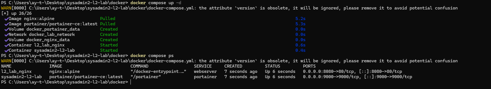
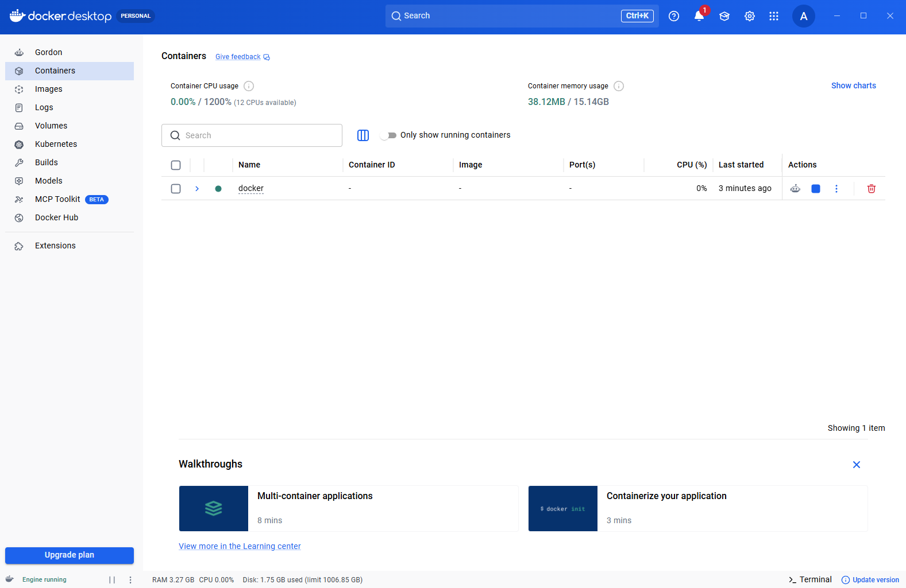

# 🐳 Docker Infrastructure & Services Lab

Este módulo contiene la configuración y orquestación de servicios base de infraestructura utilizando **Docker** y **Docker Compose**.

El objetivo es desplegar un entorno aislado, persistente y gestionable para pruebas de red, servicios web y administración de contenedores.

---

## 📂 Contenido del Módulo

| Archivo | Descripción / Funcionalidad |
| :--- | :--- |
| **`docker-compose.yml`** | Archivo de orquestación para el despliegue multi-contenedor de Nginx y Portainer. |

---

## 🚀 Detalles Técnicos y Arquitectura

El archivo `docker-compose.yml` define dos servicios principales integrados en una red dedicada:

### 🔹 1. Servidor Web Nginx (`webserver`)
- **Imagen:** `nginx:alpine` (ligera y optimizada para producción).
- **Puerto:** Mapeo del puerto local `8080` al puerto `80` del contenedor.
- **Persistencia:** Volumen `nginx_data` montado en `/usr/share/nginx/html`.

### 🔹 2. Panel de Gestión Portainer (`portainer`)
- **Imagen:** `portainer/portainer-ce:latest`.
- **Puerto:** Mapeo del puerto local `9000` para la interfaz web de administración.
- **Sockets & Datos:** Acceso al socket local `/var/run/docker.sock` para control del daemon de Docker y volumen `portainer_data` para persistencia.

### 🔹 3. Red & Aislamiento (`networks`)
- Uso de una red puente dedicada (`lab_network` con driver `bridge`) para asegurar la comunicación interna entre contenedores aislada de la red host.

---

## 🖼️ Evidencias de Ejecución y Pruebas de Laboratorio

Todas las configuraciones han sido desplegadas y probadas en el entorno local.

#### 1. Despliegue desde Consola (`docker compose up -d` y `docker compose ps`)


#### 2. Confirmación de Servicio Web Nginx Funcionando


#### 3. Estado de Contenedores en GUI (Docker Desktop)


---

## 💻 Requisitos y Modo de Uso

### Requisitos Previos
- Docker Engine y plugin de `docker compose` instalados y ejecutándose.

### Comandos de Despliegue

```bash
# Iniciar los servicios en segundo plano
docker compose up -d

# Verificar el estado de los contenedores
docker compose ps

# Ver logs del entorno
docker compose logs -f

# Detener los contenedores
docker compose down